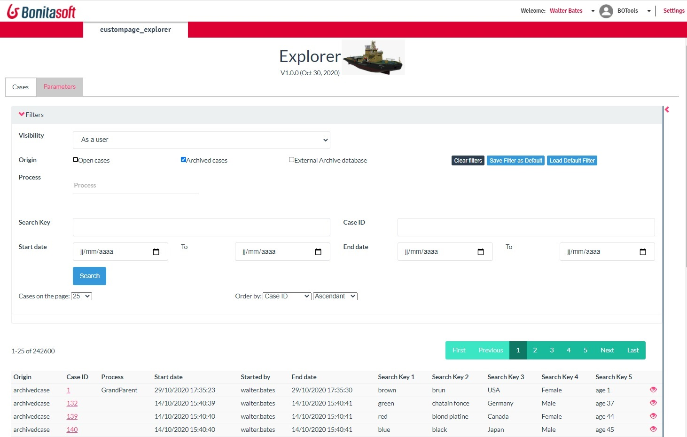
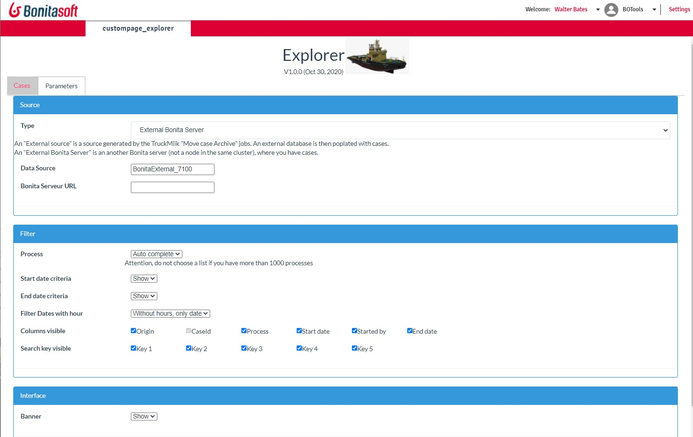

# page_explorer

## Search cases
Page explorer is used to searching cases:

* in multiple origins: Open cases, Archived cases, and external database

* via multiple criteria: caseId, and process, search key, start date, end date

  

 The result is visible in a list, and all source are combined because when you want to access the information, you don't care where it's come from isn't?

## Parameters
 As an administrator, you can configure the page. Show/hide filters, show/hide the result.
 

## Access multiple origins
You can save cases in an external Bonita server. With the page explorer, search in all sources in one click!

If the case is archived in an external Bonita server, then the case overview is a link to the page. Of course, you may need to connect on the second server to see the result.

The case may be archived in an "external database" (populated with the Truckmilk job 'Move Archive Case'). Then, data documents are available.

To move archive cases from a Bonita server to an another Bonita server, or to an Archive database, visit Truckmilk.

  